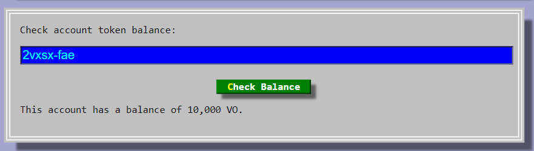

# To Run & Use the project

<b>You must first have the necessary setup required to run the following project, whose steps can be followed from here & dfx version 0.9.3 installed :-</b>

<a href="https://docs.google.com/document/d/e/2PACX-1vTNicu-xuf4EiLAehHIqgfpjAnPjzqMGT-xpZVvYaAWNyvzYK_Ceve_me4PVRIxpzH7ea5PAX9NxGwY/pub">Setup for Windows</a>
<br/>
<a href="https://docs.google.com/document/d/e/2PACX-1vTSgoWcVvuMW4Aa78MyqeK0_ZRl_MaV7rS-tdhya3jlPbSSbxczQFCohrGf87T4F7tJKXwTjT2z_QSq/pub">Setup for MAC</a>

<hr>

### Firstly, Open the folders token & opend in a seperate WSL window in VScode :-


## 1. Deploy & Run the NFT marketplace present in opend folder as follows

1. Go to the window where opend folder is present
<br/>

2. Install the necessary packages present in package.json:
   ```
   npm i
   ```
   
<br/>

3. Start local dfx:
   ```
   dfx start
   ```
   or
   ```
   dfx start --clean
   ```
   
<br/>

4. Split the terminal(ctrl+shift+5) & paste in following command there to get your principal id
   ```
   dfx identity get-principal
   ```
   
<br/>

5. Copy the principal id obtained in previous step & paste it in the "YOUR-PRINCIPAL-ID" section of the following command and paste the command in your terminal to deploy your NFT canister
   ```
     dfx deploy --argument='("CryptoDunks #123", principal "<YOUR-PRINCIPAL-ID>", (vec {137; 80; 78; 71; 13; 10; 26; 10; 0; 0; 0; 13; 73; 72; 68; 82; 0; 0; 0; 10; 0; 0; 0; 10; 8; 6; 0; 0; 0; 141; 50; 207; 189; 0; 0; 0; 1; 115; 82; 71; 66; 0; 174; 206; 28; 233; 0; 0; 0; 68; 101; 88; 73; 102; 77; 77; 0; 42; 0; 0; 0; 8; 0; 1; 135; 105; 0; 4; 0; 0; 0; 1; 0; 0; 0; 26; 0; 0; 0; 0; 0; 3; 160; 1; 0; 3; 0; 0; 0; 1; 0; 1; 0; 0; 160; 2; 0; 4; 0; 0; 0; 1; 0; 0; 0; 10; 160; 3; 0; 4; 0; 0; 0; 1; 0; 0; 0; 10; 0; 0; 0; 0; 59; 120; 184; 245; 0; 0; 0; 113; 73; 68; 65; 84; 24; 25; 133; 143; 203; 13; 128; 48; 12; 67; 147; 94; 97; 30; 24; 0; 198; 134; 1; 96; 30; 56; 151; 56; 212; 85; 68; 17; 88; 106; 243; 241; 235; 39; 42; 183; 114; 137; 12; 106; 73; 236; 105; 98; 227; 152; 6; 193; 42; 114; 40; 214; 126; 50; 52; 8; 74; 183; 108; 158; 159; 243; 40; 253; 186; 75; 122; 131; 64; 0; 160; 192; 168; 109; 241; 47; 244; 154; 152; 112; 237; 159; 252; 105; 64; 95; 48; 61; 12; 3; 61; 167; 244; 38; 33; 43; 148; 96; 3; 71; 8; 102; 4; 43; 140; 164; 168; 250; 23; 219; 242; 38; 84; 91; 18; 112; 63; 0; 0; 0; 0; 73; 69; 78; 68; 174; 66; 96; 130;}))'
   ```
   
   <br/>
   At the end, you should end up with something like this :-
   
<br/>

6. Run npm server:-
   ```
   npm start
   ```
   
<br/>

## 2. Deploy & Run the token present in token folder as follows

1. Go to the window where token folder is present
<br/>

2. Install the necessary packages present in package.json:
   ```
   npm i
   ```
   
<br/>

3. Find out your principal id:
   ```
   dfx identity get-principal
   ```
   
<br/>

4. Replace the "YOUR-PRINCIPAL-ID" in src/token/main.mo in line 14 with the principal id you got from the previous step.
   
<br/>

5. Deploy the token Canister :
   ```
   dfx deploy token
   ```
   
   <br/>
   At the end, you should end up with something like this :-
   
<br/>

6. Run npm server:-
   ```
   npm start
   ```
   
<br/>

## 3. Transfering tokens to the principal canister and claiming our tokens from the website frontend

1. Be present in the window where token folder is present & split the terminal(ctrl+shift+5)
<br/>

2. Set the canister id to a local variable:
   ```
    CANISTER_PUBLIC_KEY="principal \"$( \dfx canister id token )\""
   ```
   
<br/>

3. Transfer half a billion tokens to the canister Principal ID:
   ```
   dfx canister call token transfer "($CANISTER_PUBLIC_KEY, 500_000_000)"
   ```
   
<br/>

4. Go to http://localhost:8081, and allow popup's for localhost 8081 if your browser blocks it, then refresh the page & create your internet identity if you don't have one
   
   After the authentication is complete you should result in a page like this:
   
<br/>

5. Claim the tokens from the faucet on the frontend website.
   
   
<br/>

6. Paste 2vxsx-fae in Check account token balance & it should show the balance as 10,000 VO
   
<br/>

## 4. Creating NFT for Testing

1. Go to the window where opend folder is present & split up a new terminal in opend (ctrl + shift +  5)
<br/>

2. Mint an NFT on the command line to get NFT into mapOfNFTs: & it should return a principal id
   ```
   dfx canister call opend mint '(vec {137; 80; 78; 71; 13; 10; 26; 10; 0; 0; 0; 13; 73; 72; 68; 82; 0; 0; 0; 10; 0; 0; 0; 10; 8; 6; 0; 0; 0; 141; 50; 207; 189; 0; 0; 0; 1; 115; 82; 71; 66; 0; 174; 206; 28; 233; 0; 0; 0; 68; 101; 88; 73; 102; 77; 77; 0; 42; 0; 0; 0; 8; 0; 1; 135; 105; 0; 4; 0; 0; 0; 1; 0; 0; 0; 26; 0; 0; 0; 0; 0; 3; 160; 1; 0; 3; 0; 0; 0; 1; 0; 1; 0; 0; 160; 2; 0; 4; 0; 0; 0; 1; 0; 0; 0; 10; 160; 3; 0; 4; 0; 0; 0; 1; 0; 0; 0; 10; 0; 0; 0; 0; 59; 120; 184; 245; 0; 0; 0; 113; 73; 68; 65; 84; 24; 25; 133; 143; 203; 13; 128; 48; 12; 67; 147; 94; 97; 30; 24; 0; 198; 134; 1; 96; 30; 56; 151; 56; 212; 85; 68; 17; 88; 106; 243; 241; 235; 39; 42; 183; 114; 137; 12; 106; 73; 236; 105; 98; 227; 152; 6; 193; 42; 114; 40; 214; 126; 50; 52; 8; 74; 183; 108; 158; 159; 243; 40; 253; 186; 75; 122; 131; 64; 0; 160; 192; 168; 109; 241; 47; 244; 154; 152; 112; 237; 159; 252; 105; 64; 95; 48; 61; 12; 3; 61; 167; 244; 38; 33; 43; 148; 96; 3; 71; 8; 102; 4; 43; 140; 164; 168; 250; 23; 219; 242; 38; 84; 91; 18; 112; 63; 0; 0; 0; 0; 73; 69; 78; 68; 174; 66; 96; 130;}, "CryptoDunks #123")'
   ```
   
<br/>

3. Copy the principal id you obtained in previous step & paste it in "PRINCIPAL-ID" in the following command to list the item into mapOfListings:
   ```
   dfx canister call opend listItem '(principal "<PRINCIPAL-ID>", 5)'
   ```
   
<br/>

4. Get openD canister id:
   ```
   dfx canister id opend
   ```
   
<br/>

5. Paste your principal id & canister id obtained from the previous steps on the following command to transfer NFT to OpenD:
   ```
   dfx canister call <PRINCIPAL-ID> transferOwnership '(principal "<CANISTER-ID>", true)'
   ```
   
<br/>

6. Go to the window where token folder is present & get your token canister id:
   ```
   dfx canister id token
   ```
   
<br/>

7. Now, Go back to the window where opendD folder is present & go to src/opend_assets/src/components/item.jsx & paste your token canister you obtained from previous    step on line 165
   
<br/>

## 5. Testing the NFT

1. Go to http://localhost:8080 & the following page should show
   
<br/>

2. Go to the discover page & the following should show
   
<br/>

3. Go to the My NFT's section and click on the buy button to purchase the NFT
   
<br/>

4. Check your balance on the Dfaucet website & your balance should have reduced by some amount
   
<br/>

5. Now, go back to opend website & click on the sell button to give it a price, then click confirm
   
   And, it should show listed & owner as OpenD
   
<br/>

6. Go back to the discover page & you should see your NFT listed with it's price
   
<br/>

7. You can also go the Minter section & Mint some images present in the CryptoDunks folder & sell them
   
   
   
   
   
 
